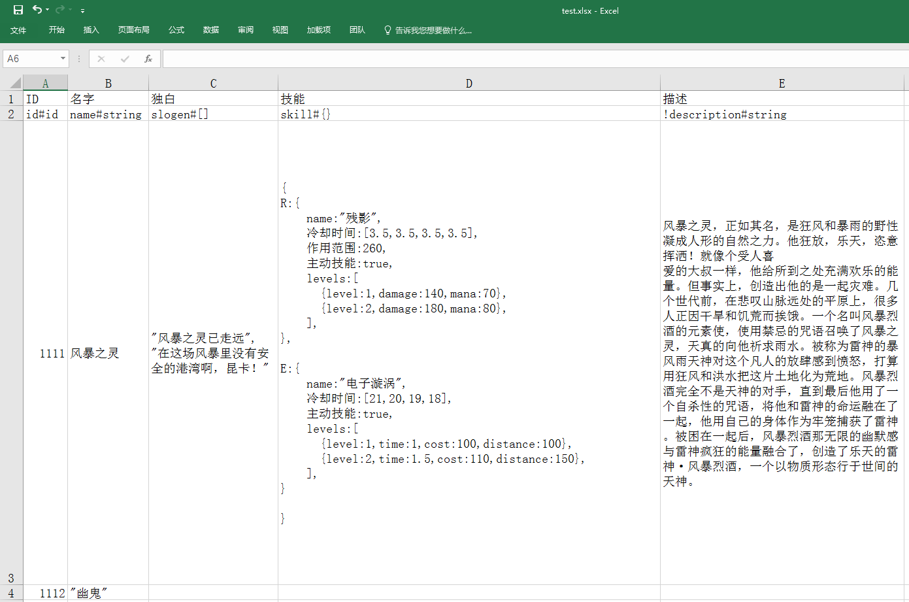
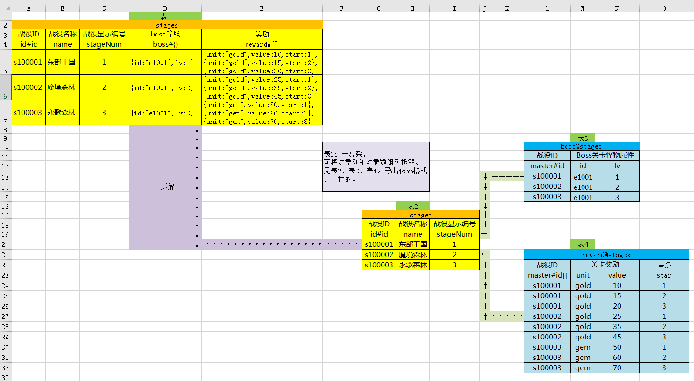

# xlsx2json
> 让excel支持复杂的json格式, 将xlsx文件转成json以及csharp脚本。

### 更新日志
* 2023-12-21 v0.1.3
  - fix: 修正intid导出不符合预期的问题。

* 2023-12-15 v0.1.2
  - optimize: 优化路径结构。

* 2023-12-14 v0.1.1
  - feature: 初次使用时自动创建配置文件。
  - feature: 导出时提供是否需要压缩json选项。

* 2023-9-22 v0.1.0
  - feature: 增加对C#脚本导出支持。
  - feature: 支持C#脚本注释导出。
  - feature: 支持更多的数值类型及其数组输出。
  - fix: 少量bug修复。

### 使用说明
* 目前只支持.xlsx和.xlsm格式，不支持.xls格式。
* 本项目是基于nodejs的，所以需要先安装nodejs环境。
* 获取本工具代码。
* 执行命令 对应系统的 export 文件即可。 

* 配置config.json
```javascript
{
    "xlsx": {
        /**
         * 表头所在的行，第一行是描述，第二行是表头, 请不要修改低于2
         */
        "head": 2,

        /**
         * xlsx或xlsm文件所在的目录
         * glob配置风格
         * 调用windows批处理无视此配置
         */
        "src": "./excel/**/[^~$]*.xls[xm]",

        /**
         * 导出的json存放的Server位置
         * 调用windows批处理请勿修改此配置
         */
        "json_server_dest": "./bin/json_server"

        /**
         * 导出带有头“_”的字段json存放的Client位置
         * 调用windows批处理请勿修改此配置
         */
        "json_client_dest": "./bin/json_client"
    },

    /**
     * 是否导出d.ts（for typescript）
     * 一张表格只导出一个d.ts文件
     */
    "ts":false,

    /**
     * 是否导出cs（for csharp）
     * 一张表格只导出一个.cs文件
     */
    "ts":false,

    "json": {
      /**
       * 导出的json是否需要压缩
       * true:压缩，false:不压缩(便于阅读的格式)
       */
      "uglify": false,
	  /**
	   * 导出配置文件的拓展名
	   */
	  "extension": ".json"
    },
    "csharp": {
      /**
      * 导出的json空间命名
      */
      "namespace": "Xlsx2Json",
      /**
       * 导出的csharp存放的Server位置
       * 调用windows批处理请勿修改此配置
       */
      "csharp_server_dest": "./bin/csharp_server"

      /**
       * 导出带有头“_”的字段csharp存放的Client位置
       * 调用windows批处理请勿修改此配置
       */
      "csharp_client_dest": "./bin/csharp_client"
    },
}
```
* 执行`export.sh|export.bat`即可将`./excel/*.xlsx` 文件导成json并存放到 `./json` 下。json名字以excel的sheet名字命名。

* 补充(一般用不上)：
    * 执行`node index.js -h` 查看使用帮助。
    * 命令行传参方式使用：执行 node `index.js --help` 查看。

#### 示例1 基本功能(参考./excel/basic.xlsx)   


输出如下(因为设置了`#id`列，输出`JsonHash`格式，如果无`#id`列则输出数组格式)：

```json
{
  "1111": {
    "id": 1111,
    "name": "风暴之灵",
    "slogen": ["风暴之灵已走远","在这场风暴里没有安全的港湾啊，昆卡！"],
    "skill": {
      "R": {
        "name": "残影",
        "冷却时间": [3.5,3.5,3.5,3.5],
        "作用范围": 260,
        "主动技能": true,
        "levels": [
          {"level": 1,"damage": 140,"mana": 70},
          {"level": 2,"damage": 180,"mana": 80}
        ]
      },
      "E": {
        "name": "电子漩涡",
        "冷却时间": [21,20,19,18],
        "主动技能": true,
        "levels": [
          {"level": 1,"time": 1,"cost": 100,"distance": 100},
          {"level": 2,"time": 1.5,"cost": 110,"distance": 150}
        ]
      }
    }
  },
  "1112": {
    "id": 1112,
    "name": "幽鬼",
    "slogen": null,
    "skill": null
  }
}
```

如果将第一列的`id#id`换成`id#string`则会输出`JsonArray`格式：

```json
[
  {
    "id": "1111",
    "name": "风暴之灵",
    "slogen": ["风暴之灵已走远","在这场风暴里没有安全的港湾啊，昆卡！"],
    "skill": {
      "R": {
        "name": "残影",
        "冷却时间": [3.5,3.5,3.5,3.5],
        "作用范围": 260,
        "主动技能": true,
        "levels": [
          {"level": 1,"damage": 140,"mana": 70},
          {"level": 2,"damage": 180,"mana": 80}
        ]
      },
      "E": {
        "name": "电子漩涡",
        "冷却时间": [21,20,19,18],
        "主动技能": true,
        "levels": [
          {"level": 1,"time": 1,"cost": 100,"distance": 100},
          {"level": 2,"time": 1.5,"cost": 110,"distance": 150}
        ]
      }
    }
  },
   {
    "id": "1112",
    "name": "幽鬼",
    "slogen": null,
    "skill": null
  }
]
```

### 示例2 复杂表格拆分(参考./excel/master-slave.xlsx)



如果一个表格某一列是`#[]` 或者`#{}`类型的时候，防止表格过于复杂，可将主表拆分。如上图所示。

比如上图中的 `表1`中 `boss#{}`和 `reward#[]`列比较复杂，可以将之拆为三个表：`表2、3、4`，将`表1`中的 `boss#{}`拆成`表3`，`表1`中的`reward#[]`拆成表4。`表2`为主表，`表3、4`为从表。


### 支持以下数据类型
* `number` 数字类型，数值类型不强制声明默认为number类型。
* `int` 32位整型类型。
* `int64` 64位整型类型。
* `float` 单精度浮点数类型。
* `int[]` 32位整型数组类型。
* `int64[]` 64位整型数组类型。
* `float[]` 单精度浮点数数组类型。
* `bool`  布尔。
* `bool[]`  布尔数组。
* `string` 字符串。
* `string[]` 字符串数组。
* `date` 日期类型。
* `object` 对象，同JS对象一致。
* `array`  数组，同JS数组一致。
* `id` 主键类型(当表中有id类型时，json会以hash格式输出，否则以array格式输出)。
* `id[]` 主键数组，只存在于从表中。
* `intid` 整数型主键类型(当表中有id类型时，json会以hash格式输出，否则以array格式输出)。
* `intid[]` 整数型主键数组，只存在于从表中。


### 表头规则

* 基本数据类型(string,number,bool)时候，一般不需要设置会自动判断，但是也可以明确声明数据类型。
* 字符串类型：命名形式 `列名#string` 。
* 数字类型：命名形式 `列名#number` 或者 `列名#int` 或者 `列名#int64` 或者 `列名#float`。
* 日期类型：`列名#date` 。日期格式要符合标准日期格式。比如`YYYY/M/D H:m:s` 或者 `YYYY/M/D` 等等。
* 布尔类型：命名形式 `列名#bool` 。
* 数组：命名形式 `列名#[]` 或者 `列名#int[]` 或者 `列名#int64[]` 或者 `列名#float[]`。数组书写可以不加左右两边的`[]`方括号。
* 对象：命名形式 `列名#{}`。数组书写可以不加左右两边的`{}`大括号。
* 主键：命名形式`列名#id` 或者 `列名#intid`,表中只能有一列。
* 主键数组：命名形式`列名#id[]` 或者 `列名#intid[]`，表中只能有一列，只存在于从表中。
* 列类型 `留空不填写` 或 以`~`开头 则不导出此列。
* 首列不设置具体数据配置，首列的数据行以`~`开头的一行则不导出此行。
* 首列首行（表的第一格）填写的描述注释为生成出的脚本注释。
* 列名字以`_`开头则导出单独一份只包含此列的Json至dest1(Server)中，dest2(Client)不导出，并且`_`开头会被移除，所以注意命名不要冲突。`id` 主键类型或`id[]` 主键数组不需要加开头。


### sheet规则

- 文件名字以`~`开头则不导出此文件下的所有表。
- sheet名字以`~`开头则不导出此表。
- sheet名字以`_`开头则导出此表至dest1(Server)中，dest2(Client)不导出，并且`_`开头会被移除，所以注意命名不要冲突。
- 从表的名字 `从表名字@主表名字`，主表必须在从表的前面。


### 主从表相关规则(master/slave)

- master表必须是hash类型，即必须有`#id`列。
- slave表名字 `slave名字@master名字`，master表的顺序必须在slave表的前面。
- slave表中必须要有`#id`列或者`#id[]`列。
- 如果将master表中的`#{}列`拆分，则slave表中应为`#id`，值为master表的id。
- 如果将master表中的`#[]列`拆分，则slave表中应为`#id[]`，值为master表的id。
- 具体请看示例`./excel/~配置文件请存放于此处 (去除~即可导出示例).xlsx` 此文件亦会在初始配置完成后出现在配置文件夹中。


### 注意事项

* 解析excel字符串的时候用到`eval()`函数，如果生产环境下excel数据来自用户输入，会有注入风险请慎用。
* 关键符号都是英文半角符号，和JSON要求一致。
* 对象写法同JavaScript中对象写法一致(不会JS的同学可理解为JSON的key不需要双引号其他和JSON一样)。
* 数组写法同JavaScript中数组写法一致(不会JS的同学可理解为JSON的key不需要双引号其他和JSON一样)。


### TODO

- [ ] 发现和维护现有问题。

### 补充

* 可在windows/mac/linux下运行。对windows支持配置后一键导出到目标路径，其他两个仅限于导出。
* 作者使用此工具需求较多的代码语言集中在C#上，所以在原工具基础上拓宽了变量类型的自动识别和定义。
* 暂时没有扩展其他语言的计划，工具本身为了简化自身开发流程，发现还不错于是开源出来（“偷懒是第一生产力”）
* 开发基于Github开源MIT项目:https://github.com/zk-luke/xlsx2json
* 工具基于MIT开源协议发布，如有问题欢迎提issue